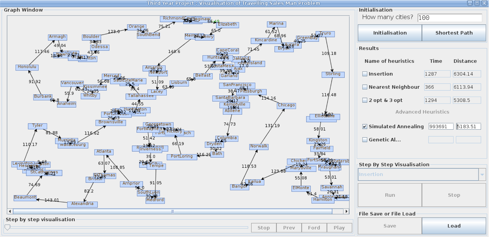

# Travelling-Salesman-Project
My final year project was entitled “Visualisation of travelling-salesman heuristics” and it was a Java application and the source code was 4482 lines. the mediator and the command design patterns were used. The mediator was for GUI activity management and the command was for heuristic algorithms. 

*Screenshot attactched: 

*The actual report is also included in this repository:
Seong_Final_Year_Report.pdf